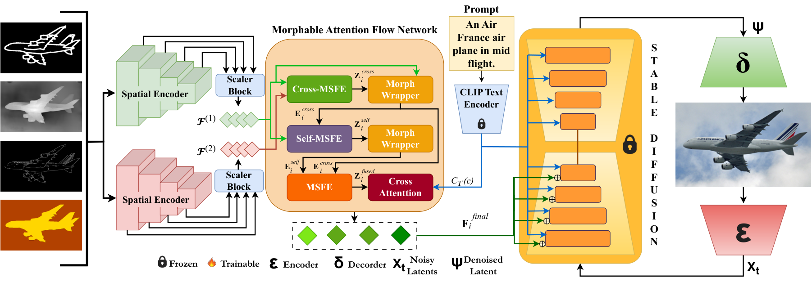

<div align="center">

<h1>UNITY: Universal Condition Adapter for Diffusion Models</h1>

<p>
<a href="https://arxiv.org/abs/2606.20971v2">

</a>
<a href="https://opensource.org/licenses/Apache-2.0">

</a>
</p>

<p>
<strong>
<a href="https://aryan-das.netlify.app/">Aryan Das</a><sup>1</sup>
&nbsp;·&nbsp;
Koushik Biswas<sup>2</sup>
&nbsp;·&nbsp;
Moloud Abdar<sup>3</sup>
&nbsp;·&nbsp;
<a href="https://sites.google.com/view/vinaycse/home">Vinay Kumar Verma</a><sup>4,*</sup>
</strong>
</p>

<p>
<sup>*</sup> Corresponding author
</p>

</div>

<p align="center">
    
</p>


**UNITY** is a universal adapter framework that enables controllable image generation from multiple spatial conditioning signals (canny edges, depth maps, scribbles, segmentation maps) using a single unified model. It builds on top of frozen Stable Diffusion 1.5 or SDXL backbones and follows a two-phase training curriculum.

---

## Repository Structure

```
UNITY/
├── data/
│   ├── __init__.py
│   └── dataset.py            # Dataset classes & get_train_dataset factory
├── models/
│   ├── __init__.py
│   ├── adapter.py            # UNITY adapter (UNITY_Config, UNITY, MAFNet, ...)
│   ├── pipeline.py           # SD 1.5 inference pipeline
│   └── pipeline_sdxl.py      # SDXL inference pipeline
├── scripts/
│   ├── train_p1_sd15.py      # Phase 1 training — SD 1.5
│   ├── train_p1_sdxl.py      # Phase 1 training — SDXL
│   ├── train_p2_sd15.py      # Phase 2 training — SD 1.5
│   └── train_p2_sdxl.py      # Phase 2 training — SDXL
├── run_p1_sd15.sh            # Launch Phase 1 — SD 1.5
├── run_p1_sdxl.sh            # Launch Phase 1 — SDXL
├── run_p2_sd15.sh            # Launch Phase 2 — SD 1.5
├── run_p2_sdxl.sh            # Launch Phase 2 — SDXL
├── utils.py                  # Shared argument parser
├── requirements.txt
└── README.md
```

---

## Environment Setup

```bash
git clone https://github.com/<your-org>/UNITY.git
cd UNITY

conda create -n unity python=3.10 -y
conda activate unity

# PyTorch — adjust the CUDA version tag as needed
pip install torch torchvision --index-url https://download.pytorch.org/whl/cu118

pip install -r requirements.txt
```

---

## Dataset Preparation

UNITY uses two datasets. The table below shows which conditions each one provides.

| Dataset          | canny | depth | scribble | segmentation |
| ---------------- | :---: | :---: | :------: | :----------: |
| **MS-COCO 2017** |   ✓   |   ✓   |    ✓     |      ✓       |
| **MultiGen-20M** |   ✓   |   ✓   |    ✓     |      ✗       |

> **MultiGen-20M does not include segmentation maps.**  
> When training with `--conditions=all` on MultiGen, the segmentation channel is automatically zero-padded so the 12-channel tensor shape is consistent with COCO.  
> For segmentation-specific fine-tuning (Phase 2) always use `--dataset_mode=coco`.

---

### Expected Directory Layout

Place (or symlink) the datasets inside the `data/` folder:

```
data/
├── coco/
│   ├── train2017/                   # JPEG images
│   ├── annotations/
│   │   └── captions_train2017.json
│   ├── canny/                       # .png, same stem as image
│   ├── depth/
│   ├── scribble/
│   └── segmentation/
└── multigen20m/
    ├── annotations/
    │   └── train.json               # [{"image": "<filename>", "caption": "..."}, ...]
    ├── source/                      # original images
    ├── canny/
    ├── depth/
    └── hed/                         # scribble (HED detector output)
```

---

### Step 1 — Download Images

**COCO 2017**

```bash
mkdir -p data/coco && cd data/coco
wget http://images.cocodataset.org/zips/train2017.zip && unzip train2017.zip
wget http://images.cocodataset.org/annotations/annotations_trainval2017.zip && unzip annotations_trainval2017.zip
cd ../..
```

**MultiGen-20M** (via HuggingFace Hub)

```bash
python -c "
from huggingface_hub import snapshot_download
snapshot_download(repo_id='showlab/MultiGen-20M', repo_type='dataset', local_dir='data/multigen20m')
"
```

---

### Step 2 — Generate Condition Maps (COCO)

MultiGen-20M ships with pre-computed condition maps. For COCO you need to generate them. Install the annotation tools:

```bash
pip install controlnet-aux
# For segmentation: install OneFormer or Mask2Former separately
```

Then run your preferred batch script. A minimal example for a single image:

```python
from controlnet_aux import CannyDetector, MidasDetector, HEDdetector
from PIL import Image

img = Image.open("data/coco/train2017/000000001000.jpg")

CannyDetector()(img).save("data/coco/canny/000000001000.png")
MidasDetector.from_pretrained("lllyasviel/Annotators")(img).save("data/coco/depth/000000001000.png")
HEDdetector.from_pretrained("lllyasviel/Annotators")(img, scribble=True).save("data/coco/scribble/000000001000.png")
# Segmentation: use OneFormer / Mask2Former and save to data/coco/segmentation/
```

Scale this up to all ~118k COCO training images before starting training.

---

### Dataset Module

The full implementation is in [`data/dataset.py`](data/dataset.py).  
It provides `COCODataset`, `MultiGenDataset`, and a `get_train_dataset` factory that accepts the following arguments:

| Argument       | Type                        | Description                                                                         |
| -------------- | --------------------------- | ----------------------------------------------------------------------------------- |
| `root_path`    | `str`                       | Root directory containing `coco/` and/or `multigen20m/`                             |
| `tokenizer`    | tokenizer or `[tok1, tok2]` | SD 1.5 tokenizer, or pair for SDXL                                                  |
| `text_encoder` | encoder or `[enc1, enc2]`   | SD 1.5 text encoder, or pair for SDXL                                               |
| `conditions`   | `str`                       | `"all"` \| `"canny"` \| `"depth_leres"` \| `"scribble_pidinet"` \| `"segmentation"` |
| `resolution`   | `int`                       | Image resolution (default 512)                                                      |
| `dataset_mode` | `str`                       | `"coco"` \| `"multigen"` \| `"both"`                                                |

Each `__getitem__` returns:

```python
{
    "pixel_values":              torch.Tensor,  # [3, H, W]  target image, normalised to [-1, 1]
    "conditioning_pixel_values": torch.Tensor,  # [C*3, H, W] stacked condition maps (C=4 Phase1, C=1 Phase2)
    "prompt_ids":                torch.Tensor,  # [77, D]    CLIP text embeddings
    "unet_added_conditions":     dict,          # SDXL only: {"text_embeds": ..., "time_ids": ...}
}
```

---

## Two-Phase Training

|                            | Phase 1                                  | Phase 2                                                       |
| -------------------------- | ---------------------------------------- | ------------------------------------------------------------- |
| **Goal**                   | Learn universal multi-condition features | Fine-tune per condition                                       |
| **`--conditions`**         | `all`                                    | `canny` / `depth_leres` / `scribble_pidinet` / `segmentation` |
| **Adapter input channels** | 12 (4 × 3ch)                             | 3 (1 × 3ch)                                                   |
| **Initialisation**         | Random                                   | Phase 1 checkpoint                                            |

---

## Training — SD 1.5

### Phase 1

Edit `run_p1_sd15.sh` to set `CONDITION`, `DATASET_MODE`, and GPU, then:

```bash
bash run_p1_sd15.sh
```

Or run directly:

```bash
PYTHONPATH=. python scripts/train_p1_sd15.py \
    --pretrained_model_name_or_path="runwayml/stable-diffusion-v1-5" \
    --output_dir="outputs/phase1/all" \
    --conditions="all" \
    --train_data_dir="data" \
    --dataset_mode="coco" \
    --mixed_precision="fp16" \
    --resolution=512 \
    --learning_rate=1e-5 \
    --max_train_steps=50000 \
    --train_batch_size=2 \
    --gradient_accumulation_steps=4 \
    --checkpointing_steps=5000 \
    --report_to="wandb" \
    --seed=42
```

### Phase 2

Edit `run_p2_sd15.sh`:

```bash
export ADAPTER_MODEL="outputs/phase1/all/checkpoint-50000/adapter"  # your Phase 1 checkpoint
export DATA_DIR="/path/to/your/dataset"
```

Then:

```bash
bash run_p2_sd15.sh
```

Or for a single condition:

```bash
PYTHONPATH=. python scripts/train_p2_sd15.py \
    --pretrained_model_name_or_path="runwayml/stable-diffusion-v1-5" \
    --pretrained_adapter_model_name_or_path="outputs/phase1/all/checkpoint-50000/adapter" \
    --output_dir="outputs/phase2/canny" \
    --conditions="canny" \
    --train_data_dir="data" \
    --dataset_mode="coco" \
    --mixed_precision="bf16" \
    --resolution=512 \
    --learning_rate=1e-5 \
    --max_train_steps=50000 \
    --train_batch_size=2 \
    --gradient_accumulation_steps=4 \
    --checkpointing_steps=5000 \
    --report_to="wandb" \
    --seed=42
```

> For segmentation fine-tuning always use `--dataset_mode=coco`.

---

## Training — SDXL

Identical structure but using the SDXL scripts:

```bash
# Phase 1
bash run_p1_sdxl.sh

# Phase 2
bash run_p2_sdxl.sh
```

Direct Phase 1 invocation:

```bash
PYTHONPATH=. python scripts/train_p1_sdxl.py \
    --pretrained_model_name_or_path="stabilityai/stable-diffusion-xl-base-1.0" \
    --output_dir="outputs/phase1/sdxl_all" \
    --conditions="all" \
    --train_data_dir="data" \
    --dataset_mode="coco" \
    --mixed_precision="fp16" \
    --resolution=512 \
    --learning_rate=1e-5 \
    --max_train_steps=50000 \
    --train_batch_size=2 \
    --gradient_accumulation_steps=4 \
    --checkpointing_steps=5000 \
    --seed=42
```

---

## Multi-GPU Training

```bash
# Configure accelerate once
accelerate config

# Launch (replace script name as needed)
accelerate launch scripts/train_p1_sd15.py \
    --pretrained_model_name_or_path="runwayml/stable-diffusion-v1-5" \
    --output_dir="outputs/phase1/all" \
    --conditions="all" \
    --train_data_dir="data" \
    --dataset_mode="both" \
    --mixed_precision="fp16" \
    --resolution=512 \
    --learning_rate=1e-5 \
    --max_train_steps=50000 \
    --train_batch_size=2 \
    --gradient_accumulation_steps=4 \
    --seed=42
```

---

## Resuming Training

```bash
# Automatically pick the latest checkpoint
PYTHONPATH=. python scripts/train_p1_sd15.py \
    ... \
    --resume_from_checkpoint="latest"
```

---

## Key Arguments

| Argument                                  | Default  | Description                                                               |
| ----------------------------------------- | -------- | ------------------------------------------------------------------------- |
| `--pretrained_model_name_or_path`         | required | HF model ID or local path                                                 |
| `--pretrained_adapter_model_name_or_path` | `None`   | Phase 1 adapter checkpoint (Phase 2 only)                                 |
| `--conditions`                            | `all`    | `all` \| `canny` \| `depth_leres` \| `scribble_pidinet` \| `segmentation` |
| `--dataset_mode`                          | `coco`   | `coco` \| `multigen` \| `both`                                            |
| `--train_data_dir`                        | required | Dataset root directory                                                    |
| `--resolution`                            | `512`    | Training image resolution                                                 |
| `--mixed_precision`                       | `no`     | `fp16` or `bf16`                                                          |
| `--learning_rate`                         | `1e-5`   | AdamW learning rate                                                       |
| `--max_train_steps`                       | `None`   | Total optimiser steps                                                     |
| `--train_batch_size`                      | `2`      | Per-GPU batch size                                                        |
| `--gradient_accumulation_steps`           | `4`      | Steps before one update                                                   |
| `--checkpointing_steps`                   | `5000`   | Save checkpoint every N steps                                             |
| `--resume_from_checkpoint`                | `None`   | Path or `"latest"`                                                        |
| `--gradient_checkpointing`                | flag     | Enable to save VRAM                                                       |
| `--report_to`                             | `wandb`  | `wandb` \| `tensorboard` \| `none`                                        |

---

## Inference

### SD 1.5

```python
import torch
from PIL import Image
from models.adapter import UNITY
from models.pipeline import StableDiffusionAdapterPipeline
from diffusers import AutoencoderKL, UNet2DConditionModel, EulerDiscreteScheduler
from transformers import CLIPTextModel, CLIPTokenizer

device = "cuda"
model_id = "runwayml/stable-diffusion-v1-5"

vae          = AutoencoderKL.from_pretrained(model_id, subfolder="vae").to(device)
unet         = UNet2DConditionModel.from_pretrained(model_id, subfolder="unet").to(device)
scheduler    = EulerDiscreteScheduler.from_pretrained(model_id, subfolder="scheduler")
text_encoder = CLIPTextModel.from_pretrained(model_id, subfolder="text_encoder").to(device)
tokenizer    = CLIPTokenizer.from_pretrained(model_id, subfolder="tokenizer")

adapter = UNITY.from_pretrained("outputs/phase2/canny/adapter").to(device)

pipe = StableDiffusionAdapterPipeline(
    vae=vae, text_encoder=text_encoder, tokenizer=tokenizer,
    unet=unet, adapter=adapter, scheduler=scheduler,
    safety_checker=None, feature_extractor=None, requires_safety_checker=False,
)

result = pipe(
    prompt="a photo of a cat sitting on a sofa",
    image=Image.open("canny_map.png").convert("RGB"),
    num_inference_steps=50,
    guidance_scale=7.5,
).images[0]
result.save("output.png")
```

### SDXL

```python
import torch
from PIL import Image
from models.adapter import UNITY
from models.pipeline_sdxl import StableDiffusionXLAdapterPipeline

device   = "cuda"
adapter  = UNITY.from_pretrained("outputs/phase2/sdxl_canny/adapter").to(device, dtype=torch.float16)
pipe     = StableDiffusionXLAdapterPipeline.from_pretrained(
    "stabilityai/stable-diffusion-xl-base-1.0",
    adapter=adapter, torch_dtype=torch.float16,
).to(device)

result = pipe(
    prompt="a futuristic city at night",
    image=Image.open("canny_map.png").convert("RGB"),
    num_inference_steps=50, guidance_scale=7.5,
).images[0]
result.save("output_sdxl.png")
```

---

## Results

The table below reports quantitative comparisons on SD 1.5 across four spatial conditions.

<p align="center">
    <strong>Table 1:</strong> Comparison of FID (↓) and CLIP (↑) scores across four conditions.
    Model complexity includes Parameters (M), FLOPs (G), and Memory (GB), where Memory
    reflects total training memory to load the SD1.5 with the adapter.
    Best are in <strong>bold</strong>.
</p>

<table>
<thead>
<tr>
<th rowspan="2">Model</th>
<th rowspan="2">Params. (M)</th>
<th rowspan="2">FLOPs (G)</th>
<th rowspan="2">Memory (GB)</th>
<th colspan="2">Canny</th>
<th colspan="2">Depth</th>
<th colspan="2">Sketch</th>
<th colspan="2">Segmentation</th>
</tr>
<tr>
<th>FID↓</th>
<th>CLIP↑</th>
<th>FID↓</th>
<th>CLIP↑</th>
<th>FID↓</th>
<th>CLIP↑</th>
<th>FID↓</th>
<th>CLIP↑</th>
</tr>
</thead>

<tbody>
<tr>
<td>ControlNet <a href="#">[39]</a></td>
<td align="center">361.28</td>
<td align="center">116.61</td>
<td align="center">24×2</td>
<td align="center">22.84</td>
<td align="center">27.41</td>
<td align="center">25.68</td>
<td align="center">27.51</td>
<td align="center">24.93</td>
<td align="center">27.38</td>
<td align="center">27.06</td>
<td align="center">27.04</td>
</tr>

<tr>
<td>T2I-Adapter <a href="#">[20]</a></td>
<td align="center"><u>77.37</u></td>
<td align="center"><u>29.97</u></td>
<td align="center">24×1</td>
<td align="center">23.73</td>
<td align="center">26.72</td>
<td align="center">26.03</td>
<td align="center">26.46</td>
<td align="center">26.51</td>
<td align="center">27.21</td>
<td align="center">27.66</td>
<td align="center">26.99</td>
</tr>

<tr>
<td>ControlNet++ <a href="#">[14]</a></td>
<td align="center">361.28</td>
<td align="center">116.61</td>
<td align="center">24×2</td>
<td align="center">23.59</td>
<td align="center">27.09</td>
<td align="center">25.19</td>
<td align="center">27.56</td>
<td align="center">24.71</td>
<td align="center">27.15</td>
<td align="center">26.23</td>
<td align="center">27.11</td>
</tr>

<tr>
<td>Uni-ControlNet <a href="#">[41]</a></td>
<td align="center">1271.42</td>
<td align="center">210.77</td>
<td align="center">24×8</td>
<td align="center">23.11</td>
<td align="center">27.21</td>
<td align="center">24.92</td>
<td align="center">27.43</td>
<td align="center">24.56</td>
<td align="center">27.54</td>
<td align="center">25.33</td>
<td align="center">27.49</td>
</tr>

<tr>
<td>CtrlLoRA <a href="#">[37]</a></td>
<td align="center">398.28</td>
<td align="center">135.15</td>
<td align="center">24×4</td>
<td align="center">22.59</td>
<td align="center">27.16</td>
<td align="center">25.65</td>
<td align="center">26.34</td>
<td align="center">26.02</td>
<td align="center">25.46</td>
<td align="center">25.73</td>
<td align="center">25.62</td>
</tr>

<tr>
<td>UniCon <a href="#">[15]</a></td>
<td align="center">150.00</td>
<td align="center">111.62</td>
<td align="center">24×8</td>
<td align="center">22.86</td>
<td align="center">26.92</td>
<td align="center">25.30</td>
<td align="center">27.42</td>
<td align="center">24.61</td>
<td align="center">27.13</td>
<td align="center">26.42</td>
<td align="center">27.04</td>
</tr>

<tr>
<td><strong>UNITY<sub>Ind</sub></strong></td>
<td align="center">365.25</td>
<td align="center">135.82</td>
<td align="center">24×1</td>
<td align="center">22.37</td>
<td align="center">28.09</td>
<td align="center">24.12</td>
<td align="center">27.90</td>
<td align="center">24.38</td>
<td align="center">27.76</td>
<td align="center">25.18</td>
<td align="center">27.89</td>
</tr>

<tr>
<td><strong>UNITY<sub>Pre</sub></strong></td>
<td align="center">365.25</td>
<td align="center">135.82</td>
<td align="center">24×1</td>
<td align="center"><strong>21.48</strong></td>
<td align="center"><strong>28.52</strong></td>
<td align="center"><strong>22.44</strong></td>
<td align="center"><strong>28.18</strong></td>
<td align="center"><strong>23.21</strong></td>
<td align="center"><strong>28.54</strong></td>
<td align="center"><strong>23.91</strong></td>
<td align="center"><strong>27.91</strong></td>
</tr>
</tbody>
</table>

<p align="center">
    <strong>Table 2:</strong> Comparison of FID (↓) and CLIP (↑) scores across four conditions.
    Model complexity includes Parameters (M), and FLOPs (G) for each adapter with the SDXL
    backbone. Best are in <strong>bold</strong>.
</p>

<table>
<thead>
<tr>
<th rowspan="2">Model</th>
<th rowspan="2">Params (M)</th>
<th rowspan="2">FLOPs (G)</th>
<th colspan="2">Canny</th>
<th colspan="2">Depth</th>
<th colspan="2">Sketch</th>
<th colspan="2">Segmentation</th>
</tr>
<tr>
<th>FID ↓</th>
<th>CLIP ↑</th>
<th>FID ↓</th>
<th>CLIP ↑</th>
<th>FID ↓</th>
<th>CLIP ↑</th>
<th>FID ↓</th>
<th>CLIP ↑</th>
</tr>
</thead>

<tbody>
<tr>
<td>ControlNet <a href="#">[39]</a></td>
<td align="center">1250.98</td>
<td align="center">1336.69</td>
<td align="center">23.75</td>
<td align="center">31.71</td>
<td align="center">26.42</td>
<td align="center">31.68</td>
<td align="center">25.87</td>
<td align="center">31.64</td>
<td align="center">27.82</td>
<td align="center">31.58</td>
</tr>

<tr>
<td>T2I-Adapter <a href="#">[20]</a></td>
<td align="center">79.03</td>
<td align="center">29.95</td>
<td align="center">24.89</td>
<td align="center">31.42</td>
<td align="center">27.18</td>
<td align="center">31.28</td>
<td align="center">27.64</td>
<td align="center">31.36</td>
<td align="center">28.91</td>
<td align="center">31.19</td>
</tr>

<tr>
<td>ControlNet++ <a href="#">[14]</a></td>
<td align="center">1250.98</td>
<td align="center">1336.69</td>
<td align="center">24.12</td>
<td align="center">31.58</td>
<td align="center">26.09</td>
<td align="center">31.54</td>
<td align="center">25.43</td>
<td align="center">31.61</td>
<td align="center">27.35</td>
<td align="center">31.52</td>
</tr>

<tr>
<td>UNITY<sub><i>Ind</i></sub></td>
<td align="center">384.83</td>
<td align="center">140.17</td>
<td align="center">21.18</td>
<td align="center">31.86</td>
<td align="center">23.42</td>
<td align="center">31.73</td>
<td align="center">23.89</td>
<td align="center">31.92</td>
<td align="center">24.54</td>
<td align="center">31.68</td>
</tr>

<tr>
<td><strong>UNITY<sub><i>Pre</i></sub></strong></td>
<td align="center">384.83</td>
<td align="center">140.17</td>
<td align="center"><strong>20.35</strong></td>
<td align="center"><strong>32.18</strong></td>
<td align="center"><strong>21.26</strong></td>
<td align="center"><strong>31.89</strong></td>
<td align="center"><strong>21.98</strong></td>
<td align="center"><strong>32.21</strong></td>
<td align="center"><strong>22.67</strong></td>
<td align="center"><strong>31.76</strong></td>
</tr>
</tbody>
</table>

---

## Memory Tips

| Technique              | Flag                                                 |
| ---------------------- | ---------------------------------------------------- |
| Mixed precision        | `--mixed_precision="fp16"` or `"bf16"`               |
| Gradient checkpointing | `--gradient_checkpointing`                           |
| Smaller batch          | `--train_batch_size=1`                               |
| More grad accumulation | `--gradient_accumulation_steps=8`                    |
| xFormers attention     | `pip install xformers` then it is used automatically |

---

## Citation

If you find UNITY useful in your research, please cite our paper:

```bibtex
@inproceedings{unity2026eccv,
  title     = {UNITY: Attention Flow Networks for Adaptive Conditioning in Diffusion},
  author    = {Das, Aryan and Biswas, Koushik and Abdar, Moloud and Verma, Vinay Kumar},
  booktitle = {Proceedings of the European Conference on Computer Vision (ECCV)},
  year      = {2026},
}
```

---

## License

This project is released under the [Apache 2.0 License](LICENSE).
